<p align="center">
  
</p>

<p align="center">
  <a href="https://github.com/ishandutta2007/Awesome-Awesome-Awesome"></a><a href="https://discord.gg/jc4xtF58Ve"></a>
  <a href="https://github.com/ishandutta2007/Awesome-Awesome-Awesome"></a>
  <a href="https://creativecommons.org/publicdomain/zero/1.0/"></a>
  <a href="https://github.com/ishandutta2007/Awesome-Application-Monitoring/blob/main/README.md"></a>
  <a href="https://github.com/ishandutta2007"></a>
</p>

# 🚀 Awesome Application Monitoring & Observability Ecosystem

> ⚡ A curated, comprehensive, and SEO-optimized directory of **Application Performance Monitoring (APM)**, **Observability**, **Error Tracking**, **Infrastructure Monitoring**, **Distributed Tracing**, and **Log Analytics** tools. Featuring top commercial SaaS platforms and leading open-source GitHub projects.

---

## 📌 Overview & Key Insights

Application Monitoring and Observability tools enable engineering teams, SREs, and DevOps professionals to monitor, analyze, profile, and optimize application health, error rates, microservice dependencies, distributed traces, metrics, and real-user experience across cloud-native, serverless, hybrid, and on-premises environments.

### 📊 Market Size & Sector Structure
* 💰 **Market Size:** The global Application Performance Monitoring (APM) and Observability market is estimated at **$18.5 Billion – $22.4 Billion (2025/2026)** and is projected to reach **$40+ Billion by 2030** (CAGR ~11.8%).
* 🧱 **Market Structure:** The sector is **moderately fragmented**. Mega-cap cloud observability providers (Datadog, Dynatrace, New Relic) control enterprise mindshare, while specialized developer-centric solutions (Sentry) and a massive wave of open-source OpenTelemetry-native engines (SigNoz, Grafana, OpenObserve) drive innovation and prevent single-vendor lock-in.

---

## 📑 Table of Contents
- [☁️ SaaS & Commercial Hosted Platforms](#%EF%B8%8F-saas--commercial-hosted-platforms)
- [🛠️ Open-Source GitHub Projects](#%EF%B8%8F-open-source-github-projects)
- [🏗️ Observability Stack Architecture](#%EF%B8%8F-observability-stack-architecture)
- [🤝 How to Contribute](#-how-to-contribute)
- [💖 Support & Sponsorship](#-support--sponsorship)
- [📈 Star History](#-star-history)
- [📄 License & Disclaimer](#-license--disclaimer)

---

## ☁️ SaaS & Commercial Hosted Platforms

*Sorted by Company Revenue / Valuation (Descending)* 📉

| 🏢 Product Name | 💰 Company Size (Revenue / Valuation) | 💳 Starting Price | 🎁 Free Tier / Trial Limit | 🌟 Key Observability Features |
| :--- | :--- | :--- | :--- | :--- |
| **[Datadog](https://www.datadoghq.com/)** | Revenue ~$4.47B<br>*(Market Cap ~$35B)* | `$15.00/host/mo` (Infra)<br>`$31.00/host/mo` (APM) | **14-day free trial** (full features)<br>*(Free tier: 5 hosts, 1-day metric retention)* | 🐕 End-to-end APM, serverless monitoring, 750+ integrations, RUM, and automated synthetic tests. |
| **[Dynatrace](https://www.dynatrace.com/)** | Revenue ~$2.02B<br>*(Market Cap ~$15B)* | `$0.08/hour` per 8 GiB host<br>*(~$58.40/host/mo)* | **15-day free trial**<br>*(Includes 1,000 synthetic test credits & 8 GiB host hours)* | 🤖 AI-driven root cause analysis (Davis AI), continuous production profiling, and auto-discovered topology. |
| **[Elastic APM](https://www.elastic.co/observability/application-performance-monitoring)** | Revenue ~$1.74B<br>*(Market Cap ~$9.6B)* | `$95.00/mo` (Elastic Cloud)<br>or `$0.035/hour` | **14-day free trial** (Elastic Cloud)<br>*(Self-hosted Basic license is free forever)* | 🔎 Native OpenTelemetry ingestion, Kibana distributed trace maps, log correlation, and machine learning alerts. |
| **[New Relic](https://newrelic.com/)** | Revenue ~$1.00B<br>*(Acquisition Valuation $6.5B)* | `$49.00/user/mo` (Standard)<br>`+$0.30/GB` ingest >100GB | **100 GB/month ingest & 1 full user free forever** | 📊 Full-stack observability platform with APM, infrastructure metrics, error tracking, and 780+ quickstarts. |
| **[SolarWinds AppOptics](https://www.solarwinds.com/appoptics)** | Parent Revenue ~$780M<br>*(Div. Est. ~$50M)* | `$9.99/host/mo` (Infra)<br>`$24.99/host/mo` (APM) | **30-day free trial**<br>*(Dev Edition free forever for pre-production environments)* | ☀️ Hybrid infrastructure monitoring, high-definition distributed tracing, and server performance metrics. |
| **[Cisco AppDynamics](https://www.appdynamics.com/)** | Revenue ~$188M<br>*(Acquired by Cisco for $3.7B)* | `$6.00/CPU core/mo` (Infra)<br>`$60.00/CPU core/mo` (APM) | **15-day free trial**<br>*(Auto-downgrades to Lite Edition with restricted metrics)* | 🏢 Business transaction monitoring, anomaly detection engine, and enterprise microservices auto-discovery. |
| **[IBM Instana](https://www.ibm.com/products/instana)** | Revenue ~$150M<br>*(Acquired by IBM for ~$500M)* | `$75.00/host/mo`<br>*(Billed annually)* | **14-day free trial**<br>*(Full APM & AutoProfile™ continuous profiling access)* | ⏱️ 1-second metric resolution, automated microservice dependency modeling, and continuous production profiling. |
| **[Sentry](https://sentry.io/)** | Revenue ~$128M<br>*(Series E Valuation $3.0B)* | `$26.00/mo` (Team Plan, annual)<br>or `$29.00/mo` | **Developer Plan free forever**<br>*(5,000 errors/mo, 10k transactions/mo, 1 user)* | 🚨 Code-level crash reporting, real-time error tracking, session replay, and performance monitoring across 100+ platforms. |
| **[Raygun](https://raygun.com/)** | Revenue ~$15M<br>*(Est. Valuation ~$40M)* | `$40.00/mo` (Crash Reporting)<br>`$80.00/mo` (APM) | **14-day free trial**<br>*(Full features, up to 5,000 events/sessions)* | 🔫 Real-user monitoring (RUM), crash reporting, deployment tracking, and server side performance trace diagnostics. |
| **[Scout APM](https://scoutapm.com/)** | Revenue ~$5M<br>*(Est. Valuation ~$20M)* | `$19.00/mo` (Basic)<br>`$161.00/mo` (Plus plan) | **14-day free trial**<br>*(Up to 300,000 transactions free during trial)* | 🕵️ Developer-centric lightweight APM focusing on N+1 query detection, memory bloat tracking, and line-of-code metrics. |

---

## 🛠️ Open-Source GitHub Projects

*Sorted by GitHub Stars_Count (Descending)* ⭐️

- **[Uptime Kuma](https://github.com/louislam/uptime-kuma)** [](https://github.com/louislam/uptime-kuma/stargazers)  
  🐻 A modern, self-hosted monitoring tool for HTTP/HTTPS, Ping, DNS, Docker, and TCP ports. Features status pages and multi-channel alerting (Slack, Telegram, Discord).

- **[Netdata](https://github.com/netdata/netdata)** [](https://github.com/netdata/netdata/stargazers)  
  ⚡ High-resolution infrastructure and application performance monitoring with per-second metrics granularity and zero-configuration auto-discovery.

- **[Elasticsearch](https://github.com/elastic/elasticsearch)** [](https://github.com/elastic/elasticsearch/stargazers)  
  🔍 Distributed, RESTful search engine powering the ELK stack for enterprise log management, APM telemetry ingestion, and distributed trace analytics.

- **[Grafana](https://github.com/grafana/grafana)** [](https://github.com/grafana/grafana/stargazers)  
  📈 The leading open-source dashboarding and visualization platform. Connects seamlessly with Prometheus, Loki, Tempo, InfluxDB, and ClickHouse.

- **[Prometheus](https://github.com/prometheus/prometheus)** [](https://github.com/prometheus/prometheus/stargazers)  
  🔥 The CNCF graduated pull-based metrics monitoring system and time-series database. Industry standard for Kubernetes monitoring with PromQL.

- **[Sentry (Open Source Engine)](https://github.com/getsentry/sentry)** [](https://github.com/getsentry/sentry/stargazers)  
  🛡️ Developer-first error tracking and performance monitoring platform. Self-hostable containerized backend capturing application exceptions and traces.

- **[SigNoz](https://github.com/SigNoz/signoz)** [](https://github.com/SigNoz/signoz/stargazers)  
  🦔 Native OpenTelemetry-based APM platform storing metrics, traces, and logs in ClickHouse. Feature-rich open-source alternative to Datadog and New Relic.

- **[InfluxDB](https://github.com/influxdata/influxdb)** [](https://github.com/influxdata/influxdb/stargazers)  
  ⏰ High-performance time-series database built for handling massive volumes of metric data, real-time analytics, and operational monitoring telemetry.

- **[Grafana Loki](https://github.com/grafana/loki)** [](https://github.com/grafana/loki/stargazers)  
  🪵 Horizontally scalable, multi-tenant log aggregation engine inspired by Prometheus. Designed for cost-effective log storage and Grafana visualization.

- **[Apache SkyWalking](https://github.com/apache/skywalking)** [](https://github.com/apache/skywalking/stargazers)  
  🌌 Enterprise-grade APM and distributed tracing system tailored for microservices, cloud-native deployments, Kubernetes, and service mesh architectures.

- **[Jaeger](https://github.com/jaegertracing/jaeger)** [](https://github.com/jaegertracing/jaeger/stargazers)  
  🎯 CNCF graduated end-to-end distributed tracing system created by Uber for monitoring microservices dependencies and performance bottlenecks.

- **[Vector](https://github.com/vectordotdev/vector)** [](https://github.com/vectordotdev/vector/stargazers)  
  🦀 Ultra-fast, Rust-built observability data pipeline for collecting, transforming, and routing logs, metrics, and traces across diverse destinations.

- **[OpenObserve](https://github.com/openobserve/openobserve)** [](https://github.com/openobserve/openobserve/stargazers)  
  🔭 Cloud-native observability engine supporting logs, metrics, traces, RUM, and session replay with 140x lower storage costs via Parquet columnar format.

- **[Quickwit](https://github.com/quickwit-oss/quickwit)** [](https://github.com/quickwit-oss/quickwit/stargazers)  
  🚀 Sub-second cloud-native search engine for observability logs and traces operating directly on S3-compatible object storage.

- **[Grafana Pyroscope](https://github.com/grafana/pyroscope)** [](https://github.com/grafana/pyroscope/stargazers)  
  🔥 Continuous profiling engine allowing developers to pinpoint CPU, memory, and I/O performance bottlenecks down to specific lines of code.

- **[Checkmate](https://github.com/bluewave-labs/Checkmate)** [](https://github.com/bluewave-labs/Checkmate/stargazers)  
  ♟️ Self-hosted server hardware, uptime, response time, and incident tracking platform featuring clean dashboards and real-time alerts.

- **[HyperDX](https://github.com/hyperdxio/hyperdx)** [](https://github.com/hyperdxio/hyperdx/stargazers)  
  💡 Developer-centric observability platform unifying session replays, logs, metrics, traces, and exception reports powered by ClickHouse & OpenTelemetry.

- **[Coroot](https://github.com/coroot/coroot)** [](https://github.com/coroot/coroot/stargazers)  
  🐝 Zero-instrumentation APM powered by eBPF. Automatically maps microservice topology, continuously profiles code, and performs AI root cause analysis.

- **[OpenTelemetry Collector](https://github.com/open-telemetry/opentelemetry-collector)** [](https://github.com/open-telemetry/opentelemetry-collector/stargazers)  
  📡 Vendor-agnostic proxy component for receiving, filtering, transforming, and exporting telemetry data across modern infrastructure stacks.

- **[Zabbix](https://github.com/zabbix/zabbix)** [](https://github.com/zabbix/zabbix/stargazers)  
  🖥️ Long-standing enterprise monitoring solution for enterprise networks, servers, virtual machines, cloud instances, and databases.

- **[Grafana Tempo](https://github.com/grafana/tempo)** [](https://github.com/grafana/tempo/stargazers)  
  ⏱️ High-scale, minimal dependency distributed tracing backend tightly integrated with Prometheus metrics and Loki log aggregation.

- **[WGCLOUD](https://github.com/tianshiyeben/wgcloud)** [](https://github.com/tianshiyeben/wgcloud/stargazers)  
  🌐 Distributed operations and infrastructure monitoring tool for host servers, Docker, Kubernetes, process metrics, and custom alarms.

- **[Uptrace](https://github.com/uptrace/uptrace)** [](https://github.com/uptrace/uptrace/stargazers)  
  📍 OpenTelemetry-native APM offering distributed tracing, PromQL metrics, and log insights with ClickHouse or PostgreSQL storage backends.

- **[Scouter](https://github.com/scouter-project/scouter)** [](https://github.com/scouter-project/scouter/stargazers)  
  🔭 Lightweight open-source APM capturing live XLog scatter charts, active service counts, JVM heap profiling, and SQL query performance.

- **[HttpReports](https://github.com/dotnetcore/HttpReports)** [](https://github.com/dotnetcore/HttpReports/stargazers)  
  🌐 Dedicated APM system for .NET Core web applications and microservices, tracking HTTP requests, latency, and distributed traces.

- **[GlitchTip](https://github.com/burke-software/GlitchTip)** [](https://github.com/burke-software/GlitchTip/stargazers)  
  🐞 Open-source Sentry-compatible error tracking and uptime monitoring platform compatible with standard Sentry client SDKs.

- **[Rails Error Dashboard](https://github.com/AnjanJ/rails_error_dashboard)** [](https://github.com/AnjanJ/rails_error_dashboard/stargazers)  
  💎 Self-hosted Ruby on Rails engine providing in-app exception tracking, multi-channel alerts, and a clean local web dashboard.

- **[Proof](https://github.com/scr34m/proof)** [](https://github.com/scr34m/proof/stargazers)  
  🧪 Minimalist Sentry protocol replacement designed for lightweight local software development and isolated test environment debugging.

- **[Argus](https://github.com/oluwatobicode/argus)** [](https://github.com/oluwatobicode/argus/stargazers)  
  👁️ Browser, Node.js, and React Native error monitoring library capturing uncaught exceptions, performance metrics, and alerting events.

---

## 🏗️ Observability Stack Architecture

Modern production observability architectures typically follow vendor-neutral telemetry pipelines:

```
[ Application Code / Microservices ]
               │
               ▼ (OpenTelemetry SDK / eBPF)
[ OpenTelemetry Collector / Vector Agent ]
               │
       ┌───────┼──────────────┐
       ▼       ▼              ▼
  (Metrics) (Logs)        (Traces)
       │       │              │
       ▼       ▼              ▼
  Prometheus  Loki /         Tempo /
  / Influx    Elastic        Jaeger
       │       │              │
       └───────┼──────────────┘
               ▼
       [ Grafana Dashboard ]
```

---

## 🤝 How to Contribute

Contributions are warmly welcomed! To add a new platform or update existing information:

1. 🍴 Fork this repository.
2. 📝 Edit `README.md` keeping formatting consistent (include name, repo link, Stars_Badge, and description).
3. 🔍 Ensure prices, free tier limits, and GitHub star links are accurate and factual.
4. 🚀 Submit a Pull Request with a short summary of changes.

---

## 💖 Support & Sponsorship

Thank you for exploring the **Awesome Application Monitoring & Observability** ecosystem list! 🌟

If you found this repository helpful, please consider showing your support:
* ⭐️ **Star** this repository to help others discover it.
* 🍴 **Fork** and contribute new tools or update existing specs.
* 📢 **Share** it with your fellow SREs, DevOps engineers, and developer communities!

### ☕ Sponsor & Buy Me a Coffee
If you'd like to support the ongoing maintenance and curation of open-source awesome lists, feel free to sponsor or buy a coffee via GitHub Sponsors:

<p fill="left">
  <a href="https://github.com/sponsors/ishandutta2007">
    
  </a>
</p>

---

## 📈 Star History

[](https://star-history.dera.page/#ishandutta2007/Awesome-Application-Monitoring&type=date&legend=top-left)

---

## 📄 License & Disclaimer

* 📜 This repository is curated under the **[Creative Commons CC0 1.0 Universal](https://creativecommons.org/publicdomain/zero/1.0/)** license.
* ⚠️ **Disclaimer:** Listed tools and financial metrics are provided for informational and educational purposes only and do not constitute commercial endorsement. Verify pricing directly on official vendor channels.

---

*Made with ❤️ for SREs, DevOps engineers, Platform teams, and Software Developers.*
